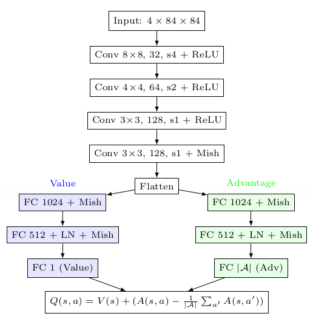
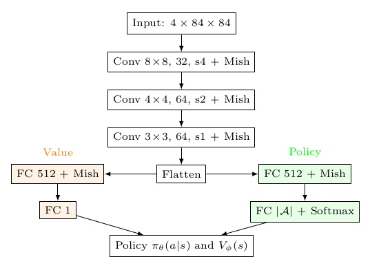
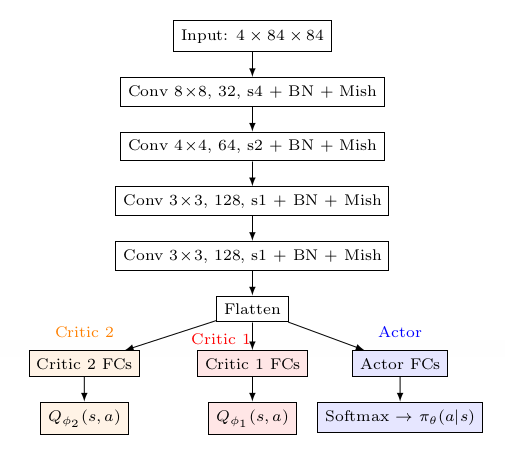

# Space Ship Game with Reinforcement Learning

## 🚀 Project Overview

This project aims to develop and compare state-of-the-art reinforcement learning (RL) algorithms for maximizing the score in a custom-built space ship game. The game is implemented in Python using Pygame and features a player-controlled spaceship that must avoid and destroy falling rocks, collect power-ups, and survive as long as possible. The main objective is to train RL agents that can achieve high scores through optimized gameplay.

> 🕹️ Gameplay Demo
<p align="center">
  
</p>

---

## Table of Contents

- [Project Structure](#project-structure)
- [Features](#features)
- [Getting Started](#getting-started)
  - [Prerequisites](#prerequisites)
  - [Install Dependencies](#install-dependencies)
  - [Running the Space Ship Game](#running-the-space-ship-game)
  - [RL Environment](#rl-environment)
  - [Training RL Agents](#training-rl-agents)
- [RL Models](#rl-models)
- [Model Validation](#model-validation)
- [Project Highlights](#project-highlights)
- [Results & Evaluation](#results--evaluation)
- [Contributors](#contributors)
- [References](#references)
- [License](#license)
- [Contact](#contact)

---

## 📁 Project Structure

```bash
Space_Ship_Game_RL/
│
├── space_ship_game_RL/
│   ├── game.py           # Main game logic and environment
│   ├── player.py         # Player spaceship class
│   ├── bullet.py         # Bullet class
│   ├── rock.py           # Rock (obstacle) class
│   ├── power.py          # Power-up class
│   ├── explosion.py      # Explosion animation class
│   ├── setting.py        # Game settings and constants
│   └── img/, sound/      # Game assets (images, sounds)
│
├── RL_controllers/
│   ├── env_wrapper.py    # RL environment wrapper for the game
│   ├── utils.py          # Preprocessing, replay buffer, and utilities
│   ├── dqn_agent.py      # (To be added) D3QN agent implementation
│   ├── SAC_discrete_agent.py # (To be added) SAC discrete agent implementation
│   ├── ppo_agent.py      # (To be added) PPO agent implementation
│   ├── train_dqn.py      # Training script for D3QN
│   ├── train_sac_discrete.py # Training script for SAC discrete
│   ├── train_ppo.py      # Training script for PPO
│   └── ...               # Additional RL utilities and scripts
│
└── README.md             # Project documentation (this file)
```

---

## 🚀 Features

- **Custom RL Environment:** The game is wrapped as a Gym-like environment for easy integration with RL algorithms.
- **Flexible State Representation:** Supports raw image input and frame stacking for deep RL.
- **Reward Engineering:** Reward function designed to maximize game score and encourage optimal behaviors.
- **Multiple RL Algorithms:** (To be added) D3QN, SAC (discrete), and PPO agents for comprehensive benchmarking.
- **Training & Evaluation Scripts:** Modular scripts for training, logging, and evaluating agent performance.
- **Visualization:** Training curves and performance metrics for comparison.

---

## 🛠️ Getting Started

### Prerequisites

- Python 3.7+
- [Pygame](https://www.pygame.org/)
- [NumPy](https://numpy.org/)
- [OpenCV](https://opencv.org/) (`cv2`)
- [Pillow](https://python-pillow.org/)
- [PyTorch](https://pytorch.org/)
- (Optional) [imageio](https://imageio.github.io/)

### Install Dependencies

```bash
pip install pygame numpy opencv-python pillow torch imageio
```

### Running the Space Ship Game

You can run the game manually for testing:

```bash
cd Space_Ship_Game_RL/space_ship_game_RL
python game.py
```

### RL Environment

The RL environment is provided via `env_wrapper.py`, which exposes the game as a Gym-like interface for agent training.

### Training RL Agents

> **Note:** RL agent code (D3QN, SAC, PPO) will be added soon. Place your agent implementations in the `RL_controllers/` directory.

Example training commands (to be updated when agents are available):

```bash
# Train D3QN agent
python RL_controllers/train_dqn.py --max_episodes 4000 --save_path d3qn_results

# Train SAC (discrete) agent
python RL_controllers/train_sac_discrete.py --max_episodes 5000 --save_path sac_results

# Train PPO agent
python RL_controllers/train_ppo.py --max_episodes 4000 --save_path ppo_results
```

---

## 🤖 RL Models

### 1. D3QN (Double Dueling Deep Q-Network)

The Double Dueling Deep Q-Network (D3QN) is an advanced value-based reinforcement learning algorithm that combines two key improvements over the standard DQN:

- **Double Q-Learning:** Reduces overestimation bias by decoupling action selection and evaluation using separate online and target networks.
- **Dueling Network Architecture:** Splits the Q-value estimation into two streams: one for the state-value function and one for the advantage function, which are then combined to produce the final Q-values for each action.

<p align="center">
  
</p>

**Network Structure:**
- Input: Stacked grayscale frames (shape: 4 × 84 × 84)
- Convolutional layers extract spatial features from the input frames.
- The output is split into two fully connected streams:
  - **Value stream:** Estimates the value of being in a given state.
  - **Advantage stream:** Estimates the advantage of each action in that state.

**Replay Buffer:**
- D3QN can be trained with either a standard replay buffer (uniform sampling) or a prioritized replay buffer (sampling transitions with higher TD error more frequently).

**Key Benefits:**
- Improved learning stability and efficiency.
- Faster convergence and higher scores in the space ship game environment.

**Related Scripts:**
- Model architecture and agent logic: [`RL_controllers/dqn_agent.py`](RL_controllers/dqn_agent.py)
- Training script: [`RL_controllers/train_dqn.py`](RL_controllers/train_dqn.py)
- Replay buffer and preprocessing: [`RL_controllers/utils.py`](RL_controllers/utils.py)
- Environment wrapper: [`RL_controllers/env_wrapper.py`](RL_controllers/env_wrapper.py)

### 2. PPO (Proximal Policy Optimization)

Proximal Policy Optimization (PPO) is a popular on-policy reinforcement learning algorithm known for its stability and ease of implementation. PPO uses a clipped surrogate objective to prevent large, destabilizing policy updates, making it robust for a wide range of environments.

<p align="center">
  
</p>

**Network Structure:**
- Separate convolutional neural networks are used for the policy (actor) and value (critic) functions.
- **Policy Network:** Outputs a probability distribution over discrete actions using a softmax layer.
- **Value Network:** Estimates the expected return (state value) for each state.
- Both networks process stacked grayscale frames (shape: 4 × 84 × 84) through convolutional layers followed by fully connected layers.

**Key Algorithm Details:**
- The agent collects trajectories and updates its policy and value networks every fixed number of timesteps using mini-batch optimization.

**Key Benefits:**
- Stable and reliable policy updates.
- Good performance in high-dimensional, discrete-action environments.

**Related Scripts:**
- Model architecture and agent logic: [`RL_controllers/ppo_agent.py`](RL_controllers/ppo_agent.py)
- Training script: [`RL_controllers/train_ppo.py`](RL_controllers/train_ppo.py)
- Replay buffer and preprocessing: [`RL_controllers/utils.py`](RL_controllers/utils.py)
- Environment wrapper: [`RL_controllers/env_wrapper.py`](RL_controllers/env_wrapper.py)

### 3. SAC (Soft Actor-Critic, Discrete)

Soft Actor-Critic (SAC) is an off-policy reinforcement learning algorithm that optimizes both expected return and policy entropy, encouraging exploration and robustness. In this project, SAC is adapted for discrete action spaces by using a categorical policy and Q-value critics.

<p align="center">
  
</p>

**Network Structure:**
- Shared convolutional feature extractor processes stacked grayscale frames (shape: 4 × 84 × 84).
- **Actor Network:** Outputs a categorical probability distribution over discrete actions using a softmax layer.
- **Critic Networks:** Two separate Q-value networks estimate the value of each action for a given state.
- All networks use deep convolutional and fully connected layers for high-dimensional visual input.

**Key Algorithm Details:**
- The agent samples actions from the learned categorical policy and stores transitions in a replay buffer.
- Critic and actor networks are updated using the SAC loss functions, with entropy regularization to promote exploration.
- Target networks are softly updated to stabilize learning.

**Key Benefits:**
- Effective exploration via entropy maximization.
- Stable and sample-efficient learning in high-dimensional, discrete-action environments.

**Related Scripts:**
- Model architecture and agent logic: [`RL_controllers/SAC_discrete_agent.py`](RL_controllers/SAC_discrete_agent.py)
- Training script: [`RL_controllers/train_sac_discrete.py`](RL_controllers/train_sac_discrete.py)
- Replay buffer and preprocessing: [`RL_controllers/utils.py`](RL_controllers/utils.py)
- Environment wrapper: [`RL_controllers/env_wrapper.py`](RL_controllers/env_wrapper.py)

---

## ✅ Model Validation

After training, the performance of the RL agents is validated by running the trained models in the Space Ship game environment and recording their gameplay. The validation process ensures that the agent's policy generalizes well and achieves high scores in a real game scenario, not just during training.

### Validation Procedure

- **Checkpoint Loading:** The best-performing model checkpoints (both policy and target networks) are loaded for evaluation. For D3QN, both normal and prioritized replay buffer variants can be validated by specifying the appropriate checkpoint files.
- **Environment Setup:** The environment is reset, and the agent interacts with it using its learned policy in evaluation mode (no exploration noise).
- **Frame Stacking:** The state is represented as a stack of recent frames, consistent with the training setup.
- **Gameplay Recording:** Each frame of the game is captured and stored, allowing for the creation of a gameplay video for qualitative analysis.
- **Performance Metrics:** The total reward and final score for each validation episode are recorded and printed for quantitative assessment.
- **Best Trial Selection:** When running multiple validation trials, the trial with the highest score is selected, and its gameplay is saved as a video for further review.

### Example Validation Workflow

- Use the provided `model_validation.py` script to load a specific checkpoint and run the agent in the environment:
    - Specify whether to use prioritized replay and the checkpoint number.
    - The script will play one episode, record the frames, and save a video of the agent's performance.

- For batch validation or to find the best trial, use the Jupyter notebook `model_validation.ipynb`, which can:
    - Run multiple validation episodes.
    - Compute average reward and score.
    - Save the best-performing trial as a video.

### Related Scripts

- [`RL_controllers/model_validation.py`](RL_controllers/model_validation.py): Script for validating a trained D3QN agent from a specific checkpoint and saving gameplay video.
- [`RL_controllers/model_validation.ipynb`](RL_controllers/model_validation.ipynb): Jupyter notebook for batch validation, checkpoint loading, and best trial selection.
- [`RL_controllers/env_wrapper.py`](RL_controllers/env_wrapper.py): Environment interface used for validation.
- [`RL_controllers/dqn_agent.py`](RL_controllers/dqn_agent.py): Agent logic and checkpoint loading.

### Notes

- The validation process can be adapted for other RL agents (PPO, SAC) by following a similar workflow: load the trained model (either as a specific `.pth` file or a `checkpoint.pth` file from the specific folder inside [`RL_controllers/saved_models/..`](RL_controllers/saved_models/) directory), run in evaluation mode, and record performance.
- For the best performance, please navigate to [`RL_controllers/saved_models/d3qn_data_2/`](RL_controllers/saved_models/d3qn_data_2/), then load [d3qn_model_ep3450.pth](RL_controllers/saved_models/d3qn_data_2/d3qn_model_ep3450.pth) and [d3qn_target_model_ep3450.pth](RL_controllers/saved_models/d3qn_data_2/d3qn_target_model_ep3450.pth) into validation scripts to see how RL plays space-ship game.
- Videos and results are saved in the `saved_models/best_trial_videos/` directory for easy review and presentation.

---

## 🌟 Project Highlights

- **Game Integrity:** The original game settings (HP, damage, scoring) are preserved for fair benchmarking.
- **Efficient Training:** Supports disabling rendering and adjusting FPS for faster training.
- **Comprehensive Evaluation:** Includes reward and score tracking, moving averages, and comparative analysis.

---

## 📊 Results & Evaluation

- Training logs and model checkpoints will be saved in the specified output directories.
- After training, use the saved models to evaluate agent performance in the visible game environment (FPS=60).
- Compare results using the provided scripts and visualization tools.

---

## 👥 Contributors
This project was developed and carried out by one master student, as the final project for the course 'Optimization and Reinforcement Learning', under the guidance of Professor [Chi-Hua Yu](https://researchoutput.ncku.edu.tw/en/persons/chi-hua-yu).

- Hong-Son Nguyen (阮洪山) - N16137037 [✉](mailto:hongsonnguyen.haui@gmail.com)

---

## 📚 References

- Dueling DQN: [Wang et al., 2016](https://arxiv.org/abs/1511.06581)
- Double Q-learning: [van Hasselt et al., 2016](https://arxiv.org/abs/1509.06461)
- Soft Actor-Critic: [Haarnoja et al., 2018](https://arxiv.org/abs/1801.01290)
- Proximal Policy Optimization: [Schulman et al., 2017](https://arxiv.org/abs/1707.06347)

---

## 📝 License

This project is for academic and research purposes. Please cite this [github_repo](https://github.com/sontypo/Space_Ship_Game_RL.git) if you use or extend this work.

---

## 📬 Contact

For questions or contributions, please open an issue or submit a pull request.